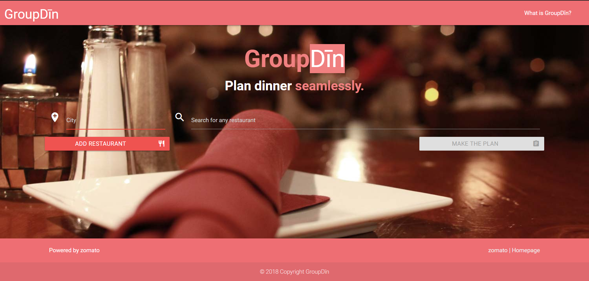
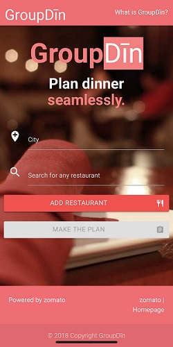
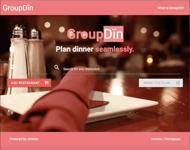
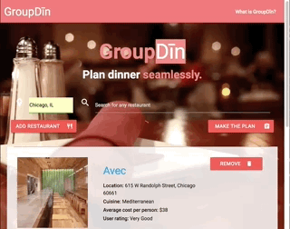
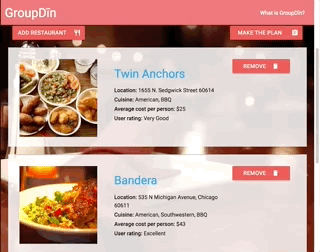

# GroupDīn

### Project Description
This web application helps a user gather information on a list of restaurants and communicate a plan to a group of friends. [Check out the site!](https://m-tuttle.github.io/Project-1/) 

### Website Homepage

### Website Mobile

### Website User Flow
   

### Technologies Used
* HTML, CSS, JavaScript, jQuery
* Materialize CSS Framework
* zomato API
* Google Maps API (JavaScript and Static)
* EmailJS library
* Firebase Database

### Team Members
* [Jake](https://github.com/JAABO)
* [Seth](https://github.com/sefeder)
* [Mike T.](https://github.com/m-tuttle)
* [Mike E.](https://github.com/mrerlander)

